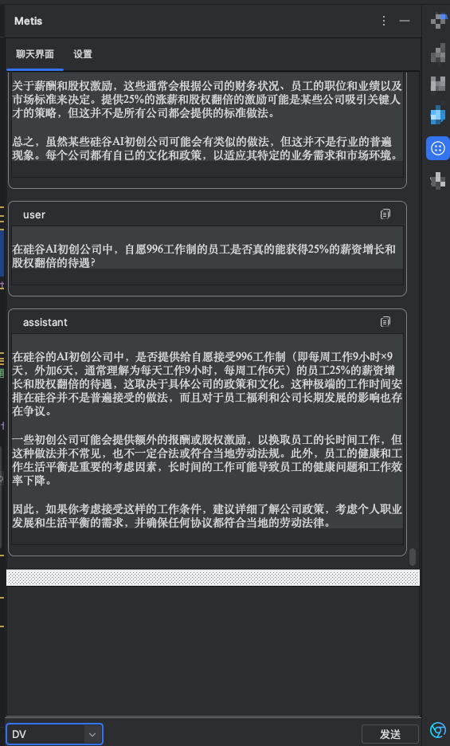
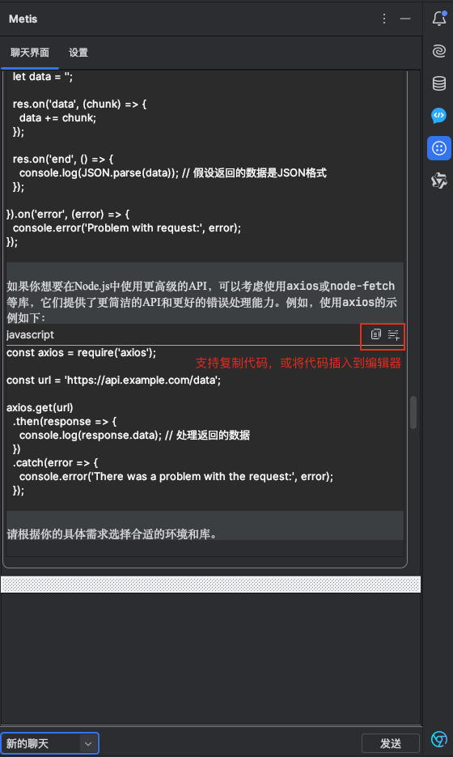
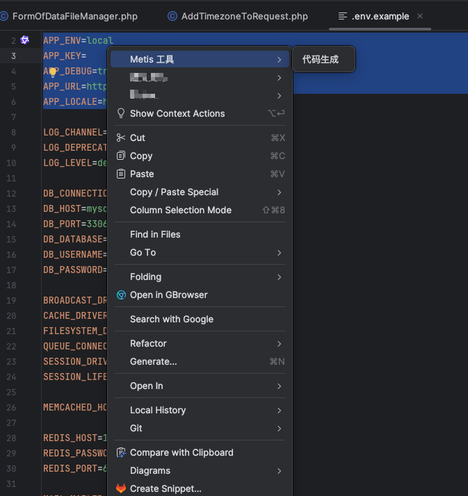

# metis-code

<!-- Plugin description -->
基于 Metis 实现的 IntelliJ AI 辅助编程插件，需要公司内部个人账号登录。
<!-- Plugin description end -->

## 关于项目

本项目是基于 Metis 实现的 IntelliJ AI 辅助编程插件。该插件旨在提升开发者的编程效率，通过集成人工智能技术，为 IntelliJ 平台用户提供更加智能、便捷的编码体验。

### 插件界面

  
  
  

### 功能特性
- 支持 Metis 对话
- 智能代码补全：根据上下文提供精准的代码建议
- 代码优化建议：提供代码重构和性能优化
- 多语言支持：支持多种主流编程语言的智能辅助

## 安装与使用
当前插件因公司原因不上线至插件市场，如需使用，请自行下载安装。
我会定时打包好 jar 包，并发布，如果没有你想要的版本，请自行打包或联系作者。
### 打包步骤
1. 确保已安装 Java 开发工具包 (JDK)。
2. 根据自身 IDE 的版本，设置 ./gradle.properties 文件中的 `pluginSinceBuild` 和 `pluginUntilBuild` 参数，详情查看 [官方说明](https://plugins.jetbrains.com/docs/intellij/build-number-ranges.html)
3. 点击 IDE 右侧的 `Gradle` -> `Tasks` -> `build` -> `build` 按钮进行打包。
4. 查找并保存生成的 ./build/libs/metis-code-xxx-instrumented.jar 文件。
5. 打开你要安装改插件的 IDE，点开 `setting` -> `Plugins` -> `Install plugin from disk` 按钮，选择 jar 文件进行安装。

## 联系作者
如有任何问题或建议，欢迎通过以下方式联系作者：
- 邮箱: [sunrungui@foxmail.com](mailto:sunrungui@foxmail.com)
